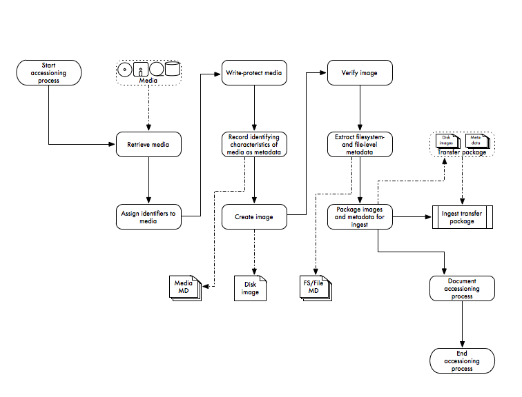

!SLIDE title-slide
# Gumshoe #

!SLIDE bullets incremental
# Re-Accessioning at Yale #

* Originates in concern that we don’t adequately have control over electronic records on media
* Attempts to mitigate risks associated with media earlier
* MPLP-like in some ways
* Gathers data to inform future decisions

!SLIDE center transition=scrollUp
# Accessioning Workflow #

!SLIDE bullets incremental
# fiwalk #

* Command line program for processing disk images
* Outputs results in plain text, XML, CSV, or ARFF
* Developed to support automated forensic processing by breaking it into three steps: extract, represent, process
* Makes development easy and fast

!SLIDE bullets incremental
# Gumshoe #

* Prototype application built on Blacklight (Ruby on Rails + Solr)
* Uses fiwalk to read disk images, or can use fiwalk output
* Populates Solr index with file-level metadata
* Provides searching and sorting on metadata
* Code at http://github.com/anarchivist/gumshoe

!SLIDE center
# Gumshoe Demo #